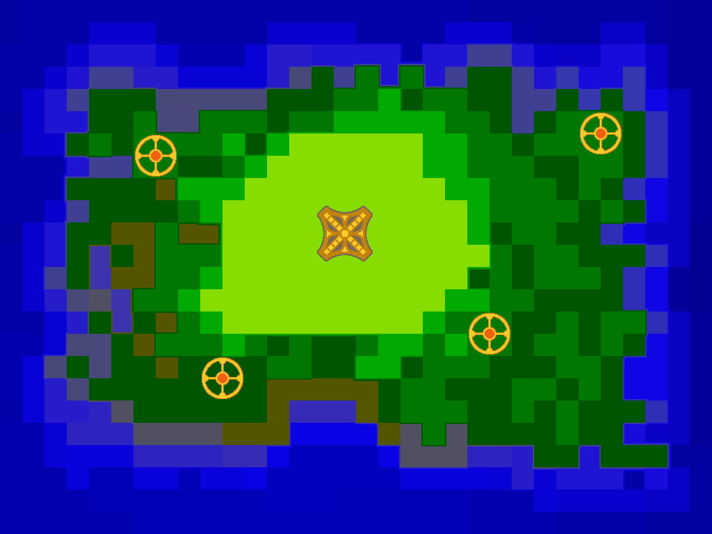

# Delay the Flood

This is my entry for Ludum Dare 50. The theme was "Delay the inevitable".

[TODO Rate here](https://ldjam.com/events/ludum-dare/)

You can not stop the flood, but you can change the terrain to delay it from reaching the colony core until the subspace beacons activate.

Obviously inspired by Creeper World, but instead of an RTS it is an ... action-puzzler, I guess?

Sorry to any colorblind players, I did not manage an alternative color scheme or proper textures :(

## Controls

- Left click to pick up soil.
- Right click to deposit soil.
- You can carry up to 5 clicks worth of soil at a time.

## Library/Engine
- [Phaser.js](https://phaser.io/)

## Tools
- [Visual Studio Code by Microsoft](https://code.visualstudio.com/)
- [Google Chrome](https://www.google.com/chrome/)
- [Pyxel Edit](https://pyxeledit.com/)
- [Gimp](https://www.gimp.org/)
